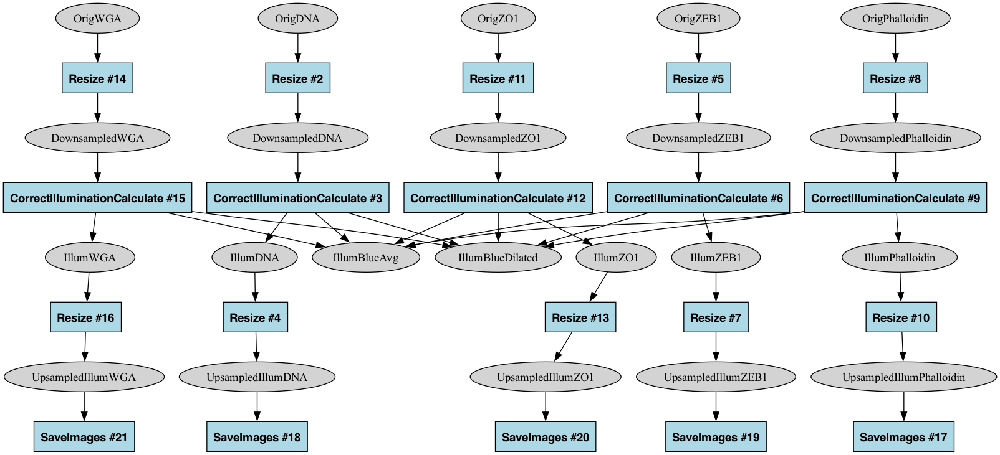

# CellProfiler Pipeline Dependency Graph

This tool extracts image dependency relationships from CellProfiler pipelines and creates a graph representation. It visualizes the flow of images through processing modules in a CellProfiler pipeline.

## Usage

```bash
python cp_graph.py <pipeline.json> [output_graph.graphml] [options]
```

- `pipeline.json` - Your CellProfiler pipeline file (v6 JSON format)
- `output_graph.graphml` - Optional output file (supports .graphml, .gexf, or .dot formats)

Options:
- `--no-module-info` - Hide module information on graph edges
- `--include-disabled` - Include disabled modules in the graph (excluded by default)

## How It Works

The script looks for two specific types of settings in each module:

1. Input images: `cellprofiler_core.setting.subscriber.image_subscriber._image_subscriber.ImageSubscriber`
2. Output images: `cellprofiler_core.setting.text.alphanumeric.name.image_name._image_name.ImageName`

For each enabled module, it creates:
1. A node for the module itself (displayed as a blue box)
2. Nodes for each input and output image (displayed as gray ovals)
3. Connections from input images to the module
4. Connections from the module to its output images

This creates a complete image dependency graph that shows both the images and the processing modules that transform them.

## Handling Disabled Modules

By default, the script ignores modules that have `enabled: false` in their attributes, as these aren't actually executed in the pipeline. If you want to include disabled modules in your graph, use the `--include-disabled` flag. Disabled modules will be displayed with a pink background and dashed outline to distinguish them from enabled modules.

## Example with 1_CP_Illum.json

```bash
# Basic usage (includes only enabled modules)
python cp_graph.py 1_CP_Illum.json 1_CP_Illum_graph.dot

# Include disabled modules
python cp_graph.py 1_CP_Illum.json 1_CP_Illum_graph.dot --include-disabled

# Hide module info on edges
python cp_graph.py 1_CP_Illum.json 1_CP_Illum_graph.dot --no-module-info
```

The script will print a summary of all connections and save the graph to the specified format.

## Visual Representation

The graph represents different elements visually:

- **Images**: Gray ovals 
- **Processing Modules**: Blue boxes with the module name and number
- **Disabled Modules**: Pink boxes with dashed borders (when included with `--include-disabled`)
- **Connections**: Arrows showing the flow from input images to modules and from modules to output images

### Module Information

Module nodes are labeled with their name and module number (e.g., "Resize #2"). This makes it easy to identify which module is performing each transformation.

When the `--no-module-info` option is used, additional labels on edges are removed for a cleaner visual representation.

## Visualizing the Output

### Using Graphviz

If you have Graphviz installed, you can render a DOT file to an image:

```bash
dot -Tpng 1_CP_Illum_graph.dot -o 1_CP_Illum_graph.png
```



### Using Other Tools

The generated files can be opened with:
- GraphML (.graphml): yEd, Cytoscape, or other graph visualization software
- GEXF (.gexf): Gephi
- DOT (.dot): Graphviz, OmniGraffle

## Requirements

- Python 3.x
- NetworkX library
- PyDot (optional, for DOT output)

Install dependencies with:
```bash
pip install networkx pydot
```
