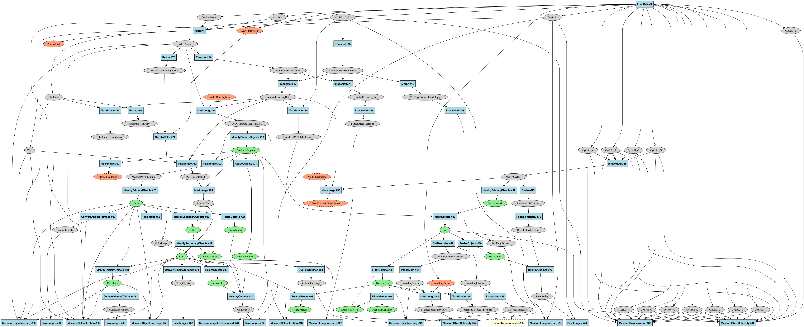
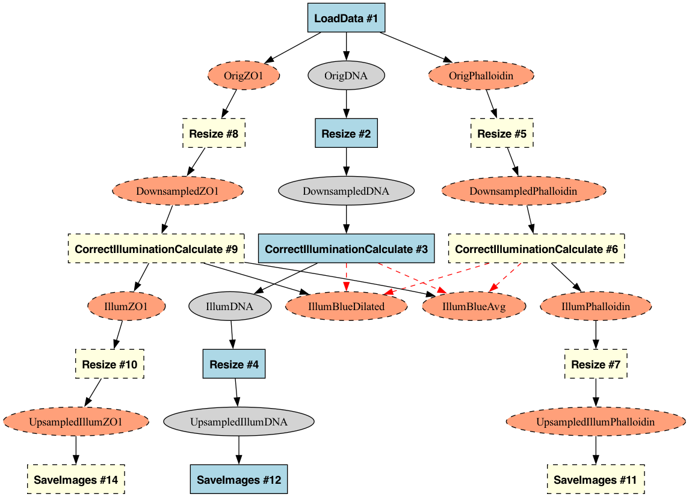

# CellProfiler Pipeline Graph Analysis Tool

This tool converts CellProfiler pipelines into standardized graph representations to analyze data flow between modules. It creates canonical pipeline visualizations and enables precise structural comparisons while deliberately excluding module settings.



## Installation & Running

- Python 3.11+
- Dependencies: NetworkX, PyDot, Click

The **recommended way** to run the tool is with `uv run --script`, which automatically handles all dependencies in an isolated environment without requiring manual installation:

```bash
# Run directly (no installation needed)
uv run --script cp_graph.py <pipeline.json> <output_file> [options]
```

If you prefer manual installation:

```bash
# Install dependencies
pip install networkx pydot click

# Then run directly
python cp_graph.py <pipeline.json> <output_file> [options]
```

## Quick Start

```bash
# Basic usage
uv run --script cp_graph.py examples/illum.json examples/output/illum.dot

# Create visualization
dot -Tpng examples/output/illum.dot -o examples/output/illum.png

# Compare pipeline structures
uv run --script cp_graph.py examples/illum.json examples/output/illum_ultra.dot --ultra-minimal
uv run --script cp_graph.py examples/illum_mod.json examples/output/illum_mod_ultra.dot --ultra-minimal
diff examples/output/illum_ultra.dot examples/output/illum_mod_ultra.dot
```

## Core Capabilities

- **Standardized Representation**: Consistent pipeline encoding for reliable comparison
- **Multi-Data Tracking**: Unified representation of images, objects, and lists
- **Filter & Highlight**: Focus on specific parts of the pipeline with visual feedback
- **Visual Analysis**: Intuitive colored graph visualization of data flow patterns

## Pipeline Visualization

The tool creates intuitive graph visualizations showing data flow through pipelines:

- **Images**: Gray ovals
- **Objects**: Green ovals 
- **Modules**: Blue boxes with the module name and number
- **Disabled Modules**: Pink boxes with dashed borders (when included)
- **Filtered Nodes**: Yellow (modules) or salmon (data) nodes with dashed borders (when using `--highlight-filtered`)
- **Connections**: Arrows showing the flow between data and modules

Output formats include:
- **DOT files**: For Graphviz visualization with `dot -Tpng <file>.dot -o <file>.png`
- **GraphML**: For tools like yEd and Cytoscape
- **GEXF**: For Gephi visualization

## Command Options

As mentioned, the recommended way to run the tool is:

```bash
uv run --script cp_graph.py <pipeline.json> <output_file> [options]
```

- `pipeline.json` - CellProfiler pipeline file (v6 JSON format)
- `output_file` - Output path (supports .graphml, .gexf, or .dot formats)

**Display Options:**
- `--no-formatting` - Strip all formatting (for pure topology analysis)
- `--no-module-info` - Hide module information on graph edges
- `--ultra-minimal` - Create minimal output for exact diff comparison
- `--explain-ids` - Print mapping of stable IDs to module numbers

**Filtering Options:**
- `--include-disabled` - Include disabled modules in the graph
- `--root-nodes=<name1,name2>` - Keep only paths from specified root nodes
- `--remove-unused-data` - Remove image and object nodes not used as inputs
- `--highlight-filtered` - Highlight nodes that would be filtered instead of removing them

## Pipeline Filtering & Highlighting

The tool provides filtering options to focus on specific parts of complex pipelines. This progression shows how filtering and highlighting work:

```bash
# Generate basic pipeline graph
uv run --script cp_graph.py examples/illum.json examples/output/illum.dot

# Highlight filtered nodes instead of removing them
uv run --script cp_graph.py examples/illum.json examples/output/illum_highlight.dot --root-nodes=OrigDNA --remove-unused-data --highlight-filtered

# Filter to show only nodes reachable from OrigDNA (removes unreachable nodes)
uv run --script cp_graph.py examples/illum.json examples/output/illum_filtered.dot --root-nodes=OrigDNA --remove-unused-data
```

<table>
<tr>
<td width="38%"></td>
<td width="38%"></td>
<td width="24%"></td>
</tr>
<tr>
<td><center><b>Original Graph</b><br>Complete pipeline</center></td>
<td><center><b>Highlighted Graph</b><br>Unreachable nodes highlighted</center></td>
<td><center><b>Filtered Graph</b><br>Unreachable nodes removed</center></td>
</tr>
</table>

Highlighting is particularly useful for exploring a pipeline to understand which parts would be affected by filters before actually removing them. As shown above, you can first visualize what would be filtered (middle image) before committing to removing those nodes (right image).

## Pipeline Comparison

The tool excels at pipeline structure comparison by creating standardized representations that ignore irrelevant differences like module reordering or numbering.

### How It Works

1. **Stable Module Identifiers**:
   - Module nodes use hash-based identifiers combining module type and I/O profile
   - Data nodes use consistent type-prefixed identifiers (e.g., "image__OrigDNA")
   - This ensures consistent identification regardless of pipeline ordering

2. **Consistent Serialization**:
   - Deterministic node and edge ordering in output files
   - Creates identical file content for functionally equivalent pipelines

3. **Unified Data Representation**:
   - Normalized representation of all data types (images, objects, lists)
   - Consistent connection semantics between modules and data

### Comparison Examples

**Example 1: Structurally Identical Pipelines**

When comparing pipelines with identical structure but different module numbers:

```bash
diff examples/output/illum_ultra.dot examples/output/illum_isoform_ultra.dot
# No output = identical structures
```

**Example 2: Detecting Functional Differences**

When comparing pipelines with actual structural differences:

```
< SaveImages_46180921 [type=module];
< image__UpsampledIllumZO1 -> SaveImages_46180921;
```

This clearly identifies the structural change, showing a missing SaveImages module and its connection.

## Example Files

The repository includes sample files:
- `examples/illum.json` - Basic illumination correction pipeline
- `examples/illum_isoform.json` - Same structure as `illum.json` with different module numbering
- `examples/illum_mod.json` - Modified pipeline with a disabled SaveImages module
- `examples/analysis.json` - Complex pipeline demonstrating various data types
- `examples/output/` - Pre-generated graph outputs

## Advanced Usage Examples

```bash
# Include disabled modules in visualization
uv run --script cp_graph.py examples/illum.json examples/output/illum_disabled.dot --include-disabled

# Create minimal representation for exact structure comparison
uv run --script cp_graph.py examples/illum.json examples/output/illum_ultra.dot --ultra-minimal

# Display detailed module ID mapping for reference
uv run --script cp_graph.py examples/illum.json examples/output/illum_ids.dot --explain-ids

# Analyze complex pipeline with multiple data types
uv run --script cp_graph.py examples/analysis.json examples/output/analysis.dot

# Filter complex analysis pipeline by specifying multiple root nodes
uv run --script cp_graph.py examples/analysis.json examples/output/analysis_filtered.dot --remove-unused-data --highlight-filtered --root-nodes=CorrPhalloidin,CorrZO1,CorrDNA,Cycle01_DAPI

```
