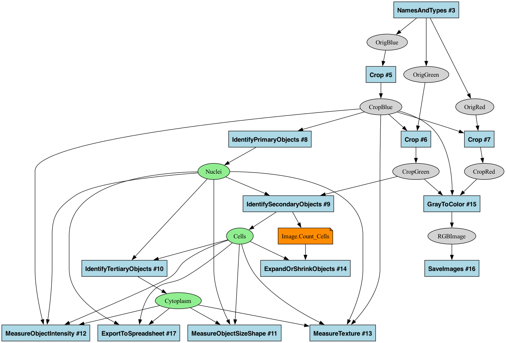

# CellProfiler Pipeline Graph Analysis Tool

This tool converts CellProfiler pipelines into standardized graph representations to analyze data flow between modules. It creates canonical pipeline visualizations and enables precise structural comparisons while deliberately excluding module settings.


<details>

```sh
./cp_graph.py \
   examples/analysis.json \
   examples/output/analysis_filtered.dot \
   --rank-nodes \
   --remove-unused-images \
   --exclude-module-types=ExportToSpreadsheet \
   --highlight-filtered \
   --rank-ignore-filtered \
   --root-nodes=CorrPhalloidin,CorrZO1,CorrDNA,Cycle01_DAPI,Cycle01_A,Cycle01_T,Cycle01_G,Cycle01_C,Cycle02_DAPI,Cycle02_A,Cycle02_T,Cycle02_G,Cycle02_C,Cycle03_DAPI,Cycle03_A,Cycle03_T,Cycle03_G,Cycle03_C && \
   pixi exec --spec "graphviz" dot -Tpng \
   examples/output/analysis_filtered.dot \
   -o examples/output/analysis_filtered.png
```
</details>

## Installation & Running

**Requirements**: [Pixi](https://pixi.sh) package manager (handles all dependencies automatically)

The tool is a self-contained executable script that uses Pixi to automatically provide all dependencies including Python packages and GraphViz:

```bash
# One-time setup: make script executable
chmod +x cp_graph.py

# Run directly - all dependencies handled automatically
./cp_graph.py <pipeline.json> <output_file> [options]
```

First run may take a moment as Pixi sets up the environment. Subsequent runs will be fast using the cached environment.

## Quick Start

```bash
# Basic usage
./cp_graph.py examples/illum.json examples/output/illum.dot

# Create visualization (GraphViz included automatically)
./cp_graph.py examples/illum.json examples/output/illum.dot
pixi exec --spec "graphviz" dot -Tpng examples/output/illum.dot -o examples/output/illum.png

# Compare pipeline structures
./cp_graph.py examples/illum.json examples/output/illum_ultra.dot --ultra-minimal
./cp_graph.py examples/illum_mod.json examples/output/illum_mod_ultra.dot --ultra-minimal
diff examples/output/illum_ultra.dot examples/output/illum_mod_ultra.dot
```

## Core Capabilities

- **Standardized Representation**: Consistent pipeline encoding for reliable comparison
- **Filter & Highlight**: Focus on specific parts of the pipeline with visual feedback
- **Visual Analysis**: Intuitive colored graph visualization of data flow patterns

## Limitations & Workarounds

CellProfiler pipeline JSON files present some inherent challenges:

- Some modules may have complex settings that make their true inputs/outputs difficult to determine
- Specialized modules like CallBarcodes don't explicitly list all inputs in the JSON
- Some objects or images may appear unused in the pipeline structure

This tool provides solutions through its filtering options:
- Use `--root-nodes` to focus on paths from known inputs
- Apply `--remove-unused-[images|objects|measurements]` to eliminate unused data nodes
- Exclude problematic modules with `--exclude-module-types=ExportToSpreadsheet`

> [!CAUTION]
> Some limitations can't be completely resolved with filtering. For example, in the visualization at the top of this README, the CallBarcodes module actually processes multiple cycle images internally, but only the first cycle appears as an explicit input in the JSON. This is why the other cycles don't show connections to the module even though they're used.
> Despite these limitations, this approach of working directly with the JSON file is valuable because it allows you to analyze pipeline structure without needing the full CellProfiler codebase. You can quickly understand and compare pipelines by focusing on their key structural components.

## Pipeline Visualization

The tool creates intuitive graph visualizations showing data flow through pipelines:

- **Images**: Gray ovals
- **Objects**: Green ovals
- **Modules**: Blue boxes with the module name and number
- **Disabled Modules**: Pink boxes with dashed borders (when included)
- **Filtered Nodes**: Yellow (modules) or salmon (data) nodes with dashed borders (when using `--highlight-filtered`)
- **Connections**: Arrows showing the flow between data and modules

Output formats include:
- **DOT files**: For Graphviz visualization with `pixi exec --spec "graphviz" dot -Tpng <file>.dot -o <file>.png`
- **GraphML**: For tools like yEd and Cytoscape
- **GEXF**: For Gephi visualization

## Command Options

```bash
./cp_graph.py <pipeline.json> <output_file> [options]
```

- `pipeline.json` - CellProfiler pipeline file (v6 JSON format)
- `output_file` - Output path (supports .graphml, .gexf, or .dot formats)

**Display Options:**
- `--no-formatting` - Strip all formatting (for pure topology analysis)
- `--no-module-info` - Hide module information on graph edges
- `--ultra-minimal` - Create minimal output for exact diff comparison
- `--explain-ids` - Print mapping of stable IDs to module numbers
- `--rank-nodes` - Position source nodes at top and sink nodes at bottom in DOT output
- `--rank-ignore-filtered` - Ignore filtered nodes when positioning source and sink nodes (use with `--rank-nodes` and `--highlight-filtered`)

**Filtering Options:**
- `--include-disabled` - Include disabled modules in the graph
- `--root-nodes=<name1,name2>` - Keep only paths from specified root nodes
- `--remove-unused-images` - Remove unused image nodes (those not used as input to a module)
- `--remove-unused-objects` - Remove unused object nodes (those not used as input to a module)
- `--remove-unused-measurements` - Remove unused measurement nodes (those not used as input to a module; only applicable with the `--dependency-graph` option)
- `--highlight-filtered` - Highlight nodes that would be filtered instead of removing them (uses distinct colors and dashed borders)
- `--exclude-module-types=<type1,type2>` - Exclude specific module types (e.g., ExportToSpreadsheet)
- `--no-single-parent` - Allow images and objects to have more than one parent (disables duplicate parent removal)

## Pipeline Filtering & Highlighting

The tool provides filtering options to focus on specific parts of complex pipelines. This progression shows how filtering and highlighting work:

```bash
# Generate basic pipeline graph
./cp_graph.py examples/illum.json examples/output/illum.dot

# Highlight filtered nodes instead of removing them (uses distinct colors and dashed borders)
./cp_graph.py examples/illum.json examples/output/illum_highlight.dot --root-nodes=OrigDNA --remove-unused-images --highlight-filtered

# Filter to show only nodes reachable from OrigDNA (removes unreachable nodes)
./cp_graph.py examples/illum.json examples/output/illum_filtered.dot --root-nodes=OrigDNA --remove-unused-images
```

<table>
<tr>
<td width="38%"></td>
<td width="38%"></td>
<td width="24%"></td>
</tr>
<tr>
<td><center><b>Original Graph</b><br>Complete pipeline</center></td>
<td><center><b>Highlighted Graph</b><br>Unreachable nodes highlighted</center></td>
<td><center><b>Filtered Graph</b><br>Unreachable nodes removed</center></td>
</tr>
</table>

Highlighting is particularly useful for exploring a pipeline to understand which parts would be affected by filters before actually removing them. As shown above, you can first visualize what would be filtered (middle image) before committing to removing those nodes (right image).

## Pipeline Comparison

The tool excels at pipeline structure comparison by creating standardized representations that ignore irrelevant differences like module reordering or numbering.

### How It Works

1. **Stable Module Identifiers**:
   - Module nodes use hash-based identifiers combining module type and I/O profile
   - Data nodes use consistent type-prefixed identifiers (e.g., "image__OrigDNA")
   - This ensures consistent identification regardless of pipeline ordering

2. **Consistent Serialization**:
   - Deterministic node and edge ordering in output files
   - Creates identical file content for functionally equivalent pipelines

3. **Unified Data Representation**:
   - Normalized representation of all data types (images, objects, lists)
   - Consistent connection semantics between modules and data

### Comparison Examples

**Example 1: Structurally Identical Pipelines**

When comparing pipelines with identical structure but different module numbers:

```bash
diff examples/output/illum_ultra.dot examples/output/illum_isoform_ultra.dot
# No output = identical structures
```

**Example 2: Detecting Functional Differences**

When comparing pipelines with actual structural differences:

```
< SaveImages_46180921 [type=module];
< image__UpsampledIllumZO1 -> SaveImages_46180921;
```

This clearly identifies the structural change, showing a missing SaveImages module and its connection.

## Example Files

The repository includes sample files:
- `examples/illum.json` - Basic illumination correction pipeline
- `examples/illum_isoform.json` - Same structure as `illum.json` with different module numbering
- `examples/illum_mod.json` - Modified pipeline with a disabled SaveImages module
- `examples/analysis.json` - Complex pipeline demonstrating various data types
- `examples/output/` - Pre-generated graph outputs

## Advanced Usage Examples

```bash
# Include disabled modules in visualization
./cp_graph.py examples/illum.json examples/output/illum_disabled.dot --include-disabled

# Create minimal representation for exact structure comparison
./cp_graph.py examples/illum.json examples/output/illum_ultra.dot --ultra-minimal

# Display detailed module ID mapping for reference
./cp_graph.py examples/illum.json examples/output/illum_ids.dot --explain-ids

# Improve graph layout with node ranking (source nodes at top, sink nodes at bottom)
./cp_graph.py examples/illum.json examples/output/illum_ranked.dot --rank-nodes

# Analyze complex pipeline with multiple data types
./cp_graph.py examples/analysis.json examples/output/analysis.dot

# Filter complex analysis pipeline by specifying multiple root nodes
./cp_graph.py examples/analysis.json examples/output/analysis_filtered.dot --remove-unused-images  --exclude-module-types=ExportToSpreadsheet --root-nodes=CorrPhalloidin,CorrZO1,CorrDNA,Cycle01_DAPI  --highlight-filtered

# Combine node ranking with filtering for optimal visualization
./cp_graph.py examples/analysis.json examples/output/analysis_ranked_filtered.dot --rank-nodes --root-nodes=CorrPhalloidin,CorrZO1 --remove-unused-images

# Combine node ranking with highlighted filtering, ignoring filtered nodes in ranking
./cp_graph.py examples/analysis.json examples/output/analysis_clean_ranked.dot --rank-nodes --rank-ignore-filtered --root-nodes=CorrPhalloidin,CorrZO1 --highlight-filtered
```

## CellProfiler 5

CellProfiler 5 has the ability to export dependency graphs (in the GUI: File -> Export -> Pipeline Dependency Graph...). This is a JSON file which describes inputs and outputs of the pipeline in a more robust way than pipeline JSON files.
The [jsonschema](https://python-jsonschema.readthedocs.io/en/stable/) for CP5 dependency graph JSON files is provided in `cp5-dep-graph-schema.json`.
A script is provided to validate the schema against pipline dependency graph JSON files generated by CellProfiler5.

```bash
scripts/validate-schema.py [--summary] [--verbose] <path/to/cp5-dep-graph.json>
```

`cp-graph` can take in the dependency graph JSON rather than the pipeline JSON by using the `--dependency-graph` flag.

> [!NOTE]
> Below we use `ExampleFly-dep-graph.json` to generate `ExampleFly-measurement.dot`. This is the standard ExampleFly pipeline found in CellProfiler's example pipeline, but (arbitrarily) modified with an `ExpandOrShrinkObjects` module which takes in the `Image.Count_Cells` measurement. This is purely to illustrate the capability to show a measurement being used for input/output, and isn't normally a sensible thing to do in the ExampleFly pipeline.

```bash
# generate the dot file
./cp_graph.py --remove-unused-objects --remove-unused-measurements --dependency-graph "examples/ExampleFly-dep-graph.json" "examples/output/ExampleFly-measurement.dot"
# convert it to png
pixi exec --spec "graphviz" dot -Tpng "examples/output/ExampleFly-measurement.dot" -o "examples/output/ExampleFly-measurement.png"
```

The above example generates the following image:


> [!IMPORTANT]
> CellProfiler generates many measurements. When generating a graph image (e.g. png), it is highly recommended to use the `--remove-unused-measuremetns` flag. This removes measurements which are not inputs to modules. Otherwise the graph would be extremely large and cluttered. Excluding that flag is still useful for the text summary of inputs and outputs.

## Technical Details

### How Stable Module IDs Work

The tool generates consistent module identifiers using SHA-256 hashing of the module's I/O pattern. This ensures that structurally identical pipelines produce identical graphs, regardless of module numbering or reordering. For example, a SaveImages module that takes `IllumDNA` as input will always get the same ID like `SaveImages_46180921`, whether it's module #10 or #22 in the pipeline.

### CellProfiler JSON Format

Unless using the `--dependency-graph` option as detailed above, the tool parses CellProfiler v6 JSON pipelines, which contain:
- **Module attributes**: enabled status, module type, original number
- **Settings**: Input/output specifications with fully qualified class names
- **Data connections**: Named references between modules (e.g., one module outputs "DNA", another inputs "DNA")

Key setting types the tool recognizes:
- **Image inputs**: ImageSubscriber, CropImageSubscriber, FileImageSubscriber, OutlineImageSubscriber
- **Image outputs**: ImageName, CropImageName, FileImageName, OutlineImageName, ExternalImageName
- **Object inputs**: LabelSubscriber
- **Object outputs**: LabelName
- **List inputs**: ImageListSubscriber, LabelListSubscriber (inputs only, no list outputs)

### Graph Structure

The generated graph uses:
- **Unified nodes**: Each data item (image/object) has one node, regardless of how many modules use it
- **Typed edges**: Preserve connection semantics (e.g., `image_input` vs `image_list_input`)
- **Deterministic ordering**: Nodes and edges are sorted for consistent output

For version history and recent changes, see [CHANGELOG.md](CHANGELOG.md).
